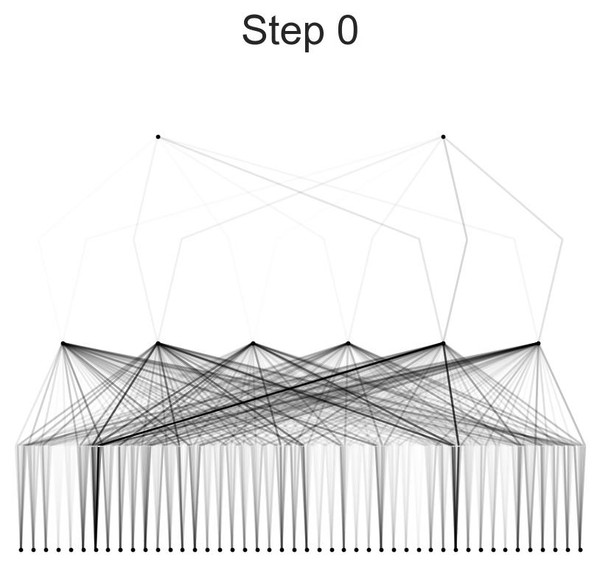
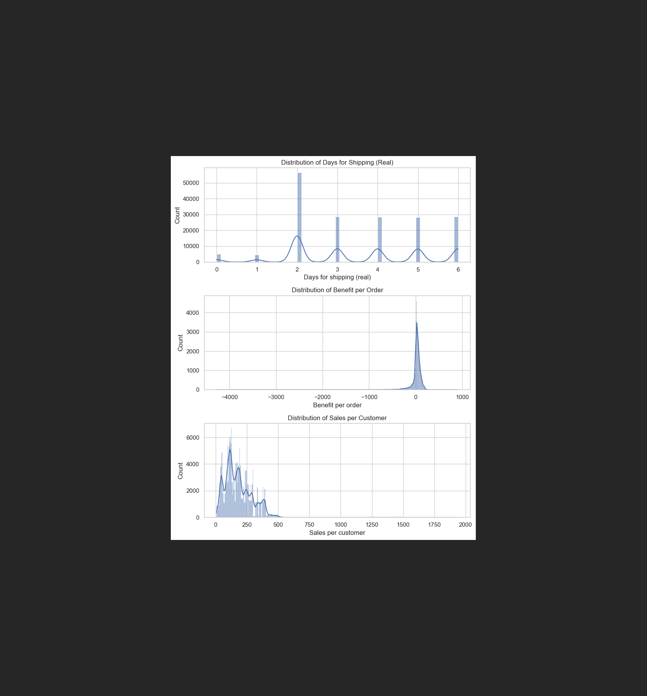
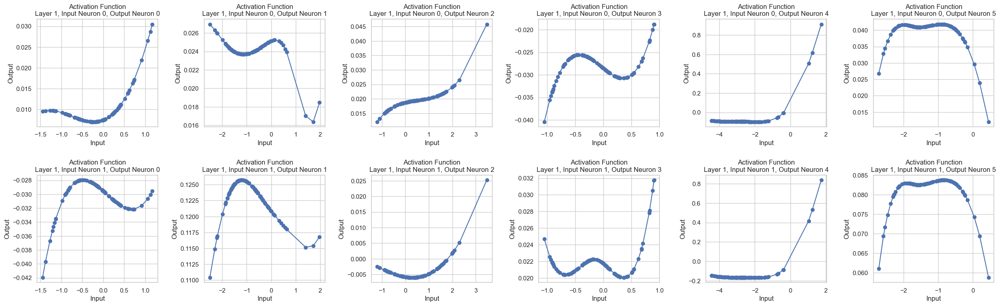
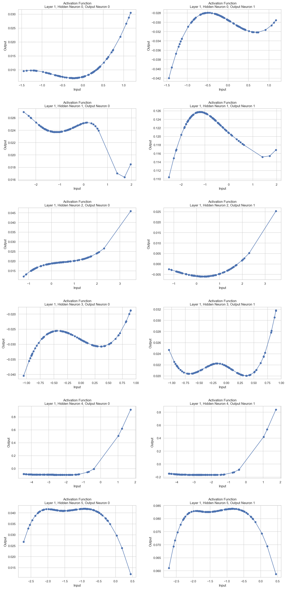

# Fraud Detection in Supply Chains Using Kolmogorov–Arnold Networks

This project, titled "Enhancing Fraud Detection in Supply Chains with Kolmogorov Arnold Networks:
A Comparative Analysis with Multi-Layer Perceptrons," aims to enhance fraud detection in supply
chains by leveraging Kolmogorov–Arnold Networks (KANs) and contrasting their performance with
traditional Multi-Layer Perceptrons (MLPs).

**Status: corrected and reproducible (2026-09-29).** The 2024 notebooks reported 98–100 % test
accuracy. That result came from target leakage and a 500-row sample. See
[Correction](#correction-2026-09-29) for the full account and [Results](#results) for the honest
numbers. The original notebooks are kept unchanged as a record; `src/kan_fraud/` is the corrected
pipeline.

---

## Correction (2026-09-29)

A code audit of the original notebooks found the reported accuracy was not a real result.

1. **Target leakage.** The label was built from `Order Status`
   (`flagged = Order Status == 'SUSPECTED_FRAUD'`), but `Order Status` was never dropped from the
   feature matrix — it was label-encoded and handed to the model, which could therefore read the
   answer. This is why `Classification_with_Loss` printed `Test Acc: 1.0` and `KAN2` printed
   `Train Accuracy: 100.00% | Test Accuracy: 100.00%` on a dataset that is **2.25 % positive**
   (4,062 of 180,519 orders are `SUSPECTED_FRAUD`).
2. **Headline numbers came from 500 rows.** `Classification/KAN_classification.ipynb` sampled
   `n=500`, and its accuracy function compared a **rounded raw logit** to the label
   (`torch.round(model(x)[:,0])`), which is not a class decision. The published
   "90.44 % train / 99 % test" came from that function.
3. **The symbolic-formula accuracy was invalid too.** `acc()` rounded a single output score and
   compared it to a 0/1 label, returning a one-element array rather than a count of correct
   predictions. A two-output KAN is decided by `logit_fraud > logit_clean`.
4. **Accuracy was the wrong metric.** With 2.25 % positives, always predicting "no fraud" scores
   97.75 %. Precision, recall, F1 and PR-AUC were never reported.
5. **Also fixed here:** encoders and the scaler fitted on the full data before the split;
   `Order Id`, `Customer Id`, `Order Item Id`, `Product Card Id` and zip codes kept as features;
   a dead label clause (`SUSPECTED_FRAUD & Late delivery` matches **zero** rows); hard-coded
   `C:\Users\...` and `/content/drive/...` paths; `model.prune(threshold=...)`, removed in
   pykan 0.2.8; 1,033 PNG frame dumps committed; the 95 MB raw CSV committed to git history.

## Results

Every run writes `results/<run_name>/metrics.json` and `summary.md`. Both numbers below are from
this machine (RTX 3080 Laptop, CUDA), with a grouped split by `Order Id`, ADASYN on the train
split only, and the symbolic branch on.

### The headline run — `configs/default.yaml` (50,000 rows, 20 LBFGS steps, 5 min 40 s)

Test set: n=10,026, 231 positives (base rate 2.30 %).

| metric | KAN (test) | majority baseline | lift |
|---|---|---|---|
| accuracy | 0.9271 | 0.9770 | **-0.0499** |
| precision | 0.0942 | 0.0000 | +0.0942 |
| recall | 0.2511 | 0.0000 | +0.2511 |
| f1 | 0.1370 | 0.0000 | +0.1370 |
| pr_auc | 0.0905 | 0.0230 | +0.0675 |
| roc_auc | 0.8813 | 0.5000 | +0.3813 |

**Accuracy is below the do-nothing baseline** (0.9271 vs 0.9770) while **ROC-AUC is 0.88** and
PR-AUC is 3.9× the base rate. The model ranks fraudulent orders well; a 0.5 cut-off is simply the
wrong operating point for a 2.3 %-positive problem:

| threshold | precision | recall | f1 | tp | fp |
|---|---|---|---|---|---|
| 0.50 (default) | 0.0942 | 0.2511 | 0.1370 | 58 | 558 |
| 0.22 (best F1) | 0.0955 | 0.5931 | 0.1646 | 137 | 1,297 |
| 0.10 | 0.0916 | **0.7835** | 0.1640 | 181 | 1,795 |
| 0.02 (closest to equal error) | 0.0868 | **0.9264** | 0.1587 | 214 | 2,252 |

At 0.10 it catches **78 % of the fraudulent orders**; at 0.02 it catches **93 %**. Precision stays
near 0.09 either way — that is the honest shape of this problem, and it is the opposite of
"99 % accuracy". The sweep is computed on the test split, so its optimum is a diagnostic, **not** a
production threshold: pick that on a validation split (the pipeline says so in `metrics.json`, and so
does `summary.md`).

### Reproducible, and tested rather than asserted

Runs seed python, numpy and torch (`data.seed`, `model.seed`) **and** request deterministic kernels
before the first CUDA call (`CUBLAS_WORKSPACE_CONFIG`, cuDNN deterministic, benchmark off,
`use_deterministic_algorithms(True, warn_only=True)`), because seeding alone is not enough on a GPU:
before this was fixed, two runs of the identical config disagreed in the third decimal
(ROC-AUC 0.8801 vs 0.8819; symbolic accuracy 0.6651 vs 0.5746).

It is now checked, not claimed: two consecutive runs of `default.yaml` into different output
directories are compared with `scripts/compare_runs.py` — every metric, the confusion matrix, the
single-feature baseline and the symbolic accuracy matched to **0.00e+00**. The residual is recorded in
`metrics.json` under `reproducibility`: ops with no deterministic CUDA kernel fall back to their
default implementation, so bitwise equality across *different* machines or GPU models is not
guaranteed.

```bash
python -m kan_fraud.run --config configs/default.yaml --run-name det-a
python -m kan_fraud.run --config configs/default.yaml --run-name det-b
python scripts/compare_runs.py results/det-a/metrics.json results/det-b/metrics.json   # expect: REPRODUCIBLE
```

### What the ranking is actually made of — the baseline that matters

"ROC-AUC 0.88" means nothing until you ask what one column achieves on its own, so the pipeline now
measures exactly that (`single_feature_baseline` in `metrics.json`, printed in `summary.md`):

- **`Type == TRANSFER` alone scores ROC-AUC 0.8697** — essentially the whole model's 0.8813.
- Every one of the 4,062 suspected-fraud orders is `Type == TRANSFER`, and no order outside that
  category is flagged (8.14 % of transfers are suspected fraud, 0.00 % of everything else — checked
  directly against the CSV).
- Every other numeric column — sales, profit, discount, shipping days, latitude, longitude — sits at
  chance: the runner-up by |AUC − 0.5| is `Order Country` at 0.4555, i.e. *below* 0.5, no better than
  noise. `at_chance` in `metrics.json` counts how many, using a sample-size-aware band (2 SE of AUC
  under the null, 0.0384 here) so small test sets do not report noise as signal.

So the network learned one categorical precondition of the label, not a fraud signature. The
one-line rule "flag transfer orders" recalls **100 % of fraud at 8.14 % precision**, which is more
recall than the network reaches at any threshold with comparable precision (0.9264 at 0.0868 at the
0.02 cut-off; 0.2511 at 0.0942 at the default 0.5). Nothing here shows a KAN detecting fraud, and no
threshold tuning changes that. It is the single most important caveat in this repository, and it is
now printed by the pipeline rather than buried in a notebook.

Symbolic form: 12 edges fitted (mean r² 0.979, min 0.882), formula test accuracy 0.6074 and train
0.7934 under its own argmax rule. The closed form generalises worse than the network it came from —
worth stating plainly rather than quoting the train figure.

### Fast check — `configs/smoke.yaml` (4,000 rows, 5 steps, ~3 min)

Test set: n=800, 15 positives. Accuracy 0.9487 vs baseline 0.9812; recall 0.0667; PR-AUC 0.0768
vs 0.0187; ROC-AUC 0.8681; formula test accuracy 0.8725. Same shape of result with far less data —
including the single-feature finding (`Type` 0.8624 vs the model's 0.8681, with 34 of 37 features
within 0.1506 of chance; the band widens with only 15 positives, which is the point of making it
sample-size aware).

Train-side metrics (0.94 accuracy on the ADASYN-resampled split) are in `metrics.json` too, but
they are measured on synthetic oversampled rows and are not comparable to the test figures — the
file carries that warning as `train_note`, and so does the symbolic block.

Scale up with `configs/full.yaml` (all 180,519 rows) before drawing any conclusion about
KAN vs MLP.

## Reproducing

```bash
# 1. environment (fresh conda env, never base) - or: bash scripts/setup_env.sh
conda create -y -n kan-fraud python=3.11
conda activate kan-fraud
pip install -e .                                          # or: pip install -r requirements.txt

# 2. run - the CSV is read straight out of the tracked zip, no manual unzip
python -m kan_fraud.run --config configs/smoke.yaml       # 4k rows, seconds
python -m kan_fraud.run --config configs/default.yaml     # 50k rows
python -m kan_fraud.run --config configs/full.yaml --device cuda    # all 180,519 rows

# 3. tests
pytest
```

Overrides: `--n-sample`, `--steps`, `--device`, `--run-name`, `--no-symbolic`.

## Pipeline

```
src/kan_fraud/
  config.py    typed dataclasses + YAML loading (unknown keys are rejected)
  data.py      load -> curate -> split -> fit-on-train -> resample train
  kan_model.py KAN construction/training against the current pykan API
  evaluate.py  precision/recall/F1/PR-AUC + confusion matrix + majority baseline
  symbolic.py  auto_symbolic with r2_threshold, valid formula accuracy
  run.py       CLI: prepare -> train -> evaluate -> symbolic -> results/
```

Rules the code enforces:

- **Label-derived columns can never reach the model.** `data.LEAK_COLUMNS` is the single source of
  truth, and `assert_no_leakage()` re-checks the final feature list on every run.
- **Split before fitting anything.** Label encoders and the standard scaler are fitted on the
  train split only; the test split is transformed with those same fitted objects.
- **Grouped split by `Order Id`.** One order contains several line items, so a random split puts
  sibling items of the same order in both splits — its own leakage channel. `split_strategy:
  random` is available for comparison.
- **Oversampling touches the train split only**, and is skipped with a recorded warning when the
  minority class is too small for ADASYN.
- **Categoricals are ordinally encoded** (the original behaviour, kept so the KAN stays small).
  That imposes a false ordering on high-cardinality columns; `metrics.json` records each
  high-cardinality feature, and test categories unseen in training get an explicit `-1` sentinel
  and are counted in `unseen_test_categories` (the 50k run reports 268 unseen `Order City` values,
  44 `Order State`, 9 `Order Country`) instead of being silently folded onto a real class.
  One-hot encoding is the obvious next experiment.
- **Location columns are features, and the column lists should not be read as "no personal data
  reaches the model"**: `Customer City/State/Country`, `Order City/State/Region/Country` and
  `Latitude`/`Longitude` are all in the matrix. On this masked copy they carry no label signal; on an
  unmasked copy they are quasi-identifiers. Masked columns (`Customer Email`, `Customer Password`,
  `Customer Street`, name fields) are dropped by `PII_COLUMNS`, which `assert_no_leakage` re-checks.
- **`Days for shipping (real)` is kept** even though it is only known after shipment: its univariate
  ROC-AUC is ~0.49, so it is not a leak, and dropping it would change the published feature set for no
  measured gain. That decision is commented in `data.py` next to `POST_HOC_COLUMNS`.
- **A run name cannot escape the results directory** — `--run-name ../x` now raises rather than writing
  outside `results/`. Curated data that still holds NaN with `drop_na_rows: false` also raises instead
  of letting the NaNs reach the scaler.

## pykan API changes

The notebooks were written against pykan ~0.2.0. This pipeline targets **pykan 0.2.8** (last
upstream commit 2025-01-19) and uses only the current API:

| then | now |
|---|---|
| `model.train(dataset, ...)` | `model.fit(dataset, ..., loss_fn=...)` |
| hand-rolled LBFGS loop | `model.fit(..., opt="LBFGS", steps=..., metrics=(...))` |
| `model.prune(threshold=1e-4)` | `model.prune(node_th=1e-2, edge_th=3e-2)` |
| one-hot float label column | long class indices + `CrossEntropyLoss` |
| — | `model.speed()` for accuracy-only runs (disables the symbolic branch) |
| `auto_symbolic(lib=...)` | `auto_symbolic(lib=..., r2_threshold=..., weight_simple=...)` |

## Repository Structure

- **src/kan_fraud**: the corrected pipeline (installed as the `kan-fraud` package).
- **configs**: smoke / default / full run configurations.
- **tests**: pytest suite — leakage guards, split-before-fit, metrics, end-to-end smoke.
- **Article**: the detailed study and findings (its numbers are the ones corrected above).
- **Classification**: original notebooks — classification, and classification with the custom loss.
- **Regression**: original regression notebook.
- **PCA_and_other_approaches**: original PCA experiments.
- **MLP_and_Keras_Model**: original MLP/Keras comparison.
- **DataCoSupplyChainDataset.zip**: the dataset used for the study (180,519 × 53).
- **DescriptionDataCoSupplyChain.csv**: description of the dataset features.

## Data

DataCo Smart Supply Chain dataset, from
[Mendeley](https://data.mendeley.com/datasets/8gx2fvg2k6/5). Personal fields in the public copy are
pre-masked (`XXXXXXXXX`); the pipeline drops them regardless, so pointing it at an unmasked copy is
safe. Check the source dataset's licence before redistributing the zip.

## Evaluation Metrics

- Symbolic formulas are fitted with `auto_symbolic(r2_threshold=...)`, so edges that cannot be
  matched confidently stay splines instead of being forced onto a wrong closed form.
- Formula accuracy is computed as `argmax(logit_clean, logit_fraud) == label`, on both splits.
- Model activations can still be plotted and the network pruned with `model.prune()`;
  pruning now uses the current `node_th`/`edge_th` arguments.

## Analysis and Insights

- **Accuracy is not the metric.** A KAN that predicts "no fraud" for every order scores 97.75 %.
  Precision, recall, F1 and PR-AUC are reported next to that baseline, and the baseline is printed
  in every run.
- **Interpretability** remains the interesting KAN property: the pruned, symbolically-fitted
  network yields a closed-form decision boundary per output neuron.
- **Compute**: the symbolic branch is slow; `model.speed()` disables it for accuracy-only runs and
  `--device cuda` uses the GPU for larger samples.

## Suggestions

- **Next experiments**: one-hot rather than ordinal encoding for high-cardinality categoricals;
  a fair KAN vs MLP vs gradient-boosting comparison on one fixed test split with PR-AUC; a
  cost-sensitive threshold instead of 0.5, since a missed fraud costs more than a false alarm.
- **Ideal applications**: pharmaceutical, manufacturing, market research, energy, environmental
  science and legal compliance.

## Contributing

Contributions are welcome. Please fork the repository, make your changes, and submit a pull
request. For major changes, open an issue first.

## Requirements

Python 3.9+ and the pinned stack in `requirements.txt` (generated from the working environment:
pykan 0.2.8, torch, numpy, pandas, scikit-learn, imbalanced-learn, matplotlib, seaborn, sympy,
pyyaml, tqdm). Install with `pip install -e .`; for pykan itself see the
[installation guide](https://github.com/KindXiaoming/pykan?tab=readme-ov-file#installation).

## References

- Soori, M., & Arezoo, B. (2023). Artificial Neural Networks (ANNs) in supply chain management:
  Opportunities and challenges. Journal of Economy and Technology, 18(3), 87-102.
- Das, S. (2023). Artificial Neural Networks for Fraud Detection in Supply Chain Analytics:
  MLPClassifier and Keras. GitHub repository.
- Liu, Z., et al. (2024). Kolmogorov–Arnold Networks. arXiv preprint arXiv:2404.19756.
- pykan: https://github.com/KindXiaoming/pykan · https://kindxiaoming.github.io/pykan/

For more details, refer to the
[Article](https://chrisd-7.github.io/ChrisDSilva/assets/files/articles/KAN-Article/KANArticle.html)
directory.

## Citation

```bibtex
@article{liu2024kan,
  title={KAN: Kolmogorov-Arnold Networks},
  author={Liu, Ziming and Wang, Yixuan and Vaidya, Sachin and Ruehle, Fabian and Halverson, James and Solja{\v{c}}i{\'c}, Marin and Hou, Thomas Y and Tegmark, Max},
  journal={arXiv preprint arXiv:2404.19756},
  year={2024}
}
```

## To Cite me

```bibtex
@project{ChrisD-7,
  title={Enhancing Fraud Detection in Supply Chains with Kolmogorov Arnold Networks: A Comparative Analysis with Multi-Layer Perceptrons},
  author={Chris DSilva},
  year={2024},
  howpublished={\url{https://github.com/ChrisD-7/Fraud-Detection-in-Supply-Chains-with-Kolmogorov-Arnold-Networks/blob/main/README.md}}
}
```

## Classification Model



## EDA and Model Building with Pruning


## Activation Function Plots



